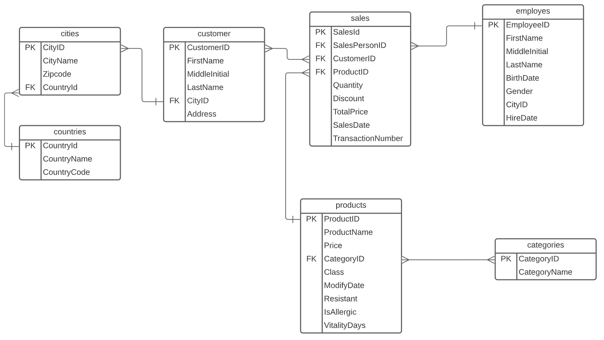

# SOEN 363 - Phase-2

## Q3 - BigData with SQL

### (a) - Dataset: Grocery Sales

**_You can find the data on Kaggle, at the following address:
<https://www.kaggle.com/codemysteries/salesdb>_**

The data set that was chosen is a reasonably sized sales dataset for groceries
sold in various cities throughout the entire United States of America. There
are 7 files in total in the dataset:

- `categories.csv`
- `cities.csv`
- `countries.csv`
- `customers.csv`
- `employes.csv`
- `products.csv`
- `sales.csv`
- **_TOTAL SIZE: `753.22MB`_**

### (b) - Creating the database: PostgreSQL

#### **_DATABASE:_** `PostgreSQL v13.2`

<br>

#### **_ENTITY RELATION DIAGRAM (ERD):_**



<br />

#### **_DATA DEFINITION (DDL):_**

```sql
-- Countries
CREATE TABLE Countries (
    CountryID INTEGER NOT NULL,
    CountryName VARCHAR(50),
    CountryCode VARCHAR(2),
    PRIMARY KEY (CountryID)
);

-- Cities
CREATE TABLE Cities (
    CityID INTEGER NOT NULL,
    CityName VARCHAR(50),
    Zipcode INTEGER,
    CountryID INTEGER NOT NULL,
    PRIMARY KEY (CityID),
    FOREIGN KEY (CountryID) REFERENCES countries(CountryID)
);

-- Customers
CREATE TABLE Customers (
    CustomerID INTEGER NOT NULL,
    FirstName VARCHAR(50),
    MiddleInitial VARCHAR(1),
    LastName VARCHAR(50),
    CityID INTEGER NOT NULL,
    Address VARCHAR(255),
    PRIMARY KEY (CustomerID),
    FOREIGN KEY (CityID) REFERENCES cities(CityID)
);

-- Categories
CREATE TABLE Categories (
    CategoryID INTEGER NOT NULL,
    CategoryName VARCHAR(50),
    PRIMARY KEY (CategoryID)
);

-- Products
CREATE TABLE Products (
    ProductID INTEGER NOT NULL,
    ProductName VARCHAR(255),
    Price REAL,
    CategoryID INTEGER NOT NULL,
    Class VARCHAR(50),
    ModifyDate TIMESTAMP,
    Resistant VARCHAR(20),
    IsAllergic VARCHAR(10),
    VitalityDays INTEGER,
    PRIMARY KEY (ProductID),
    FOREIGN KEY (CategoryID) REFERENCES categories(CategoryID)
);

-- Employees
CREATE TABLE Employes (
    EmployeeID INTEGER NOT NULL,
    FirstName VARCHAR(50),
    MiddleInitial VARCHAR(1),
    LastName VARCHAR(50),
    BirthDate TIMESTAMP,
    Gender VARCHAR(1),
    CityID INTEGER NOT NULL,
    HireDate TIMESTAMP,
    Address VARCHAR(255),
    PRIMARY KEY (EmployeeID),
    FOREIGN KEY (CityID) REFERENCES cities(CityID)
);

-- Sales
CREATE TABLE Sales (
    SalesID INTEGER NOT NULL,
    SalesPersonID INTEGER NOT NULL,
    CustomerID INTEGER NOT NULL,
    ProductID INTEGER NOT NULL,
    Quantity INTEGER,
    Discount REAL,
    TotalPrice REAL,
    SalesDate TIMESTAMP,
    TransactionNumber VARCHAR(20),
    PRIMARY KEY (SalesID),
    FOREIGN KEY (SalesPersonID) REFERENCES employes(EmployeeID),
    FOREIGN KEY (CustomerID) REFERENCES customers(CustomerID),
    FOREIGN KEY (ProductID) REFERENCES products(ProductID)
);
```

### (c) - Loading the data

**_Docker Image:_** <https://hub.docker.com/repository/docker/obonobo/soen363-phase-2-postgres>

For reproducability, a Docker image was created containing PostgreSQL v13.2. All
the data has been preloaded into the Docker image. You can pull the image and
examine the database by executing the following in your terminal (requires
`docker` to be installed):

```bash
# Pull the latest docker image
docker pull obonobo/soen363-phase-2-postgres:latest

# Spin up an instance of postgres
docker run -d \
    -p 5432:5432 \
    -e PGDATA=/data \
    -e POSTGRES_DB=soen363 \
    -e POSTGRES_USER=admin \
    -e POSTGRES_PASSWORD=admin123 \
    obonobo/soen363-phase-2-postgres:latest
```

Alternatively, you can use the `docker-compose.yml` file packaged alongside this
report. This will spin up 3 containers (PostgreSQL, PGAdmin, MongoDB):
`docker-compose up -d`

The data required a few steps of processing before it was successfully loaded
into Postgres. All the scripts used for preprocessing and data cleaning have
been included alongside this report. Check out the `scripts/` dir for the source
code.

### (d) - Reports

10 SQL queries were created to extract interesting pieces of information about
grocery sales in the US.

#### 1. How much do discounts effect sales?

This query reports the average quantity of items sold, ordered by the discount
(if any) that has been applied to the item. As expected, items with discounts,
on average, tend to have higher sales.

```sql
SELECT discount, AVG(quantity) FROM Sales
WHERE discount IN (
  SELECT distinct discount
  FROM Sales
  ORDER BY discount DESC)
OR discount IS NULL
GROUP BY discount;
```

#### 2. Which employee has sold the most seafood?

```sql
SELECT
    COUNT(*) AS numsales,
    firstname,
    lastname,
    birthdate,
    cityname,
    zipcode,
    countryname
FROM Sales s
    INNER JOIN products p ON s.productid = p.productid
    INNER JOIN categories c ON p.categoryid = c.categoryid
    INNER JOIN employes e ON s.salespersonid = e.employeeid
    INNER JOIN cities ci ON e.cityid = ci.cityid
    INNER JOIN countries co ON ci.countryid = co.countryid
WHERE categoryname = 'Seafood'
GROUP BY firstname, lastname, birthdate, cityname, zipcode, countryname
ORDER BY numsales DESC
LIMIT 1;
```

#### 3. What are the top-selling item categories in Tucson, Arizona?

```sql
SELECT ca.categoryname, COUNT(ca.categoryid)
FROM customers cu
    INNER JOIN sales s  ON cu.customerid = s.customerid
    INNER JOIN cities c ON cu.cityid = c.cityid
    INNER JOIN products p ON s.productid = p.productid
    INNER JOIN categories ca ON p.categoryid = ca.categoryid
WHERE c.cityname = 'Tucson'
GROUP BY ca.categoryid
ORDER BY COUNT(ca.categoryid) DESC;
```

#### 4. How much money does each US city spend on chocolate?

```sql
SELECT COUNT(s.salesid), ci.cityname
FROM sales s
INNER JOIN products p ON s.productid = p.productid
INNER JOIN customers c ON s.customerid = c.customerid
INNER JOIN cities ci on c.cityid = ci.cityid
WHERE p.productname like '%Chocolate%'
GROUP BY ci.cityname
ORDER BY COUNT(s.salesid) DESC;
```

#### 5. Which orders in our system are expired?

```sql
SELECT
    s.salesid,
    p.productname,
    p.modifydate,
    s.salesdate,
    (DATE_PART('day', s.salesdate- p.modifydate):: integer) as daydiff,
    p.vitalitydays,
CASE
    WHEN p.vitalitydays > (DATE_PART('day', s.salesdate- p.modifydate):: integer)
    THEN 'Good'
    ELSE 'Expired'
    END AS FOODSTATUS
FROM products p
INNER JOIN sales s ON s.productid = p.productid
WHERE s.salesdate IS NOT NULL
AND p.vitalitydays IS NOT NULL
AND p.vitalitydays IS NOT NULL
AND (DATE_PART('day', s.salesdate- p.modifydate):: integer) >= 0;
```

#### 6. How many customers does each city have?

```sql
SELECT COUNT(c.cityid), c.cityid, ci.cityname
FROM customers c
INNER JOIN cities ci ON c.cityid = ci.cityid
GROUP BY c.cityid, ci.cityname
ORDER BY COUNT(c.customerid) DESC;
```

#### 7. Who are the top 5 people who purchased the most wine?

```sql
SELECT COUNT(s.productid), c.firstname ,c.middleinitial, c.lastname
FROM sales s
INNER JOIN products p ON s.productid = p.productid
INNER JOIN customers c ON s.customerid = c.customerid
WHERE p.productname like '%Wine%'
GROUP BY s.productid,c.firstname,c.middleinitial, c.lastname
ORDER BY COUNT(s.productid) DESC
LIMIT 5;
```

#### 8. Which employees are from the millenial generation?

```sql
SELECT *
FROM employes e
WHERE e.birthdate
    BETWEEN '1981-01-01 00:00:00'
    AND '1996-12-31 23:59:59';
```

#### 9. Which employees are from the Gen X generation?

```sql
SELECT *
FROM employes e
WHERE e.birthdate
    BETWEEN '1965-01-01 00:00:00'
    AND '1980-12-31 23:59:59';
```

#### 10. Who are the employees hired since 2016?

```sql
SELECT *
FROM employes e
WHERE e.hiredate
    BETWEEN '2016-01-01 00:00:00'
    AND NOW();
```

### (e)

## Q4 - NoSQL Databases

### (a)

### (b)

### (c)

### (d)

### (e)

#### 1.

#### 2.

#### 3.

#### 4.

#### 5.

#### 6.

#### 7.

#### 8.

#### 9.

#### 10.

### (f)

### (g)
